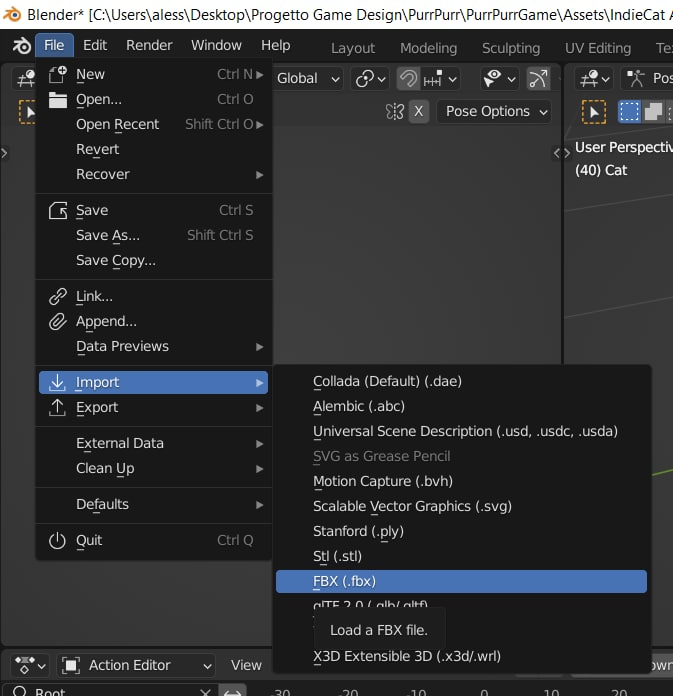
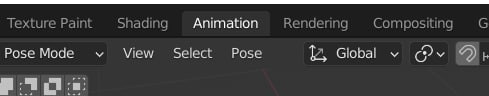
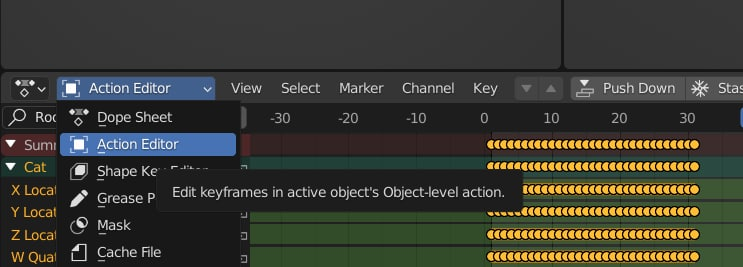
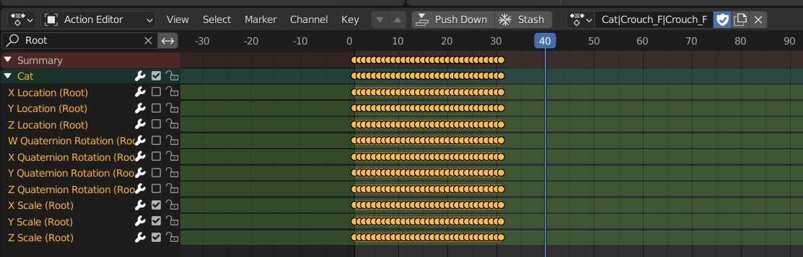
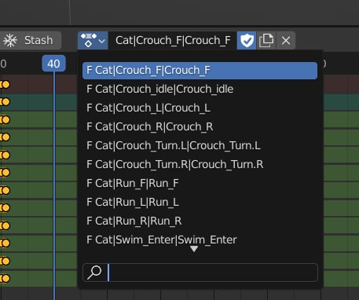
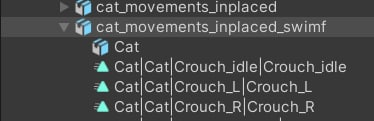
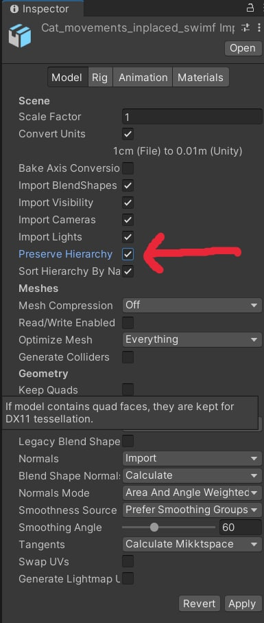
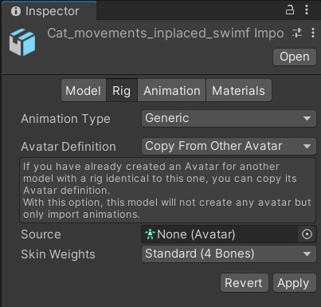
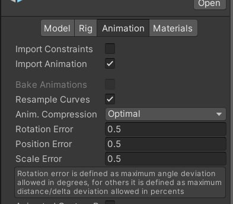
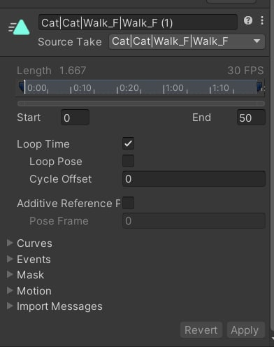

# In Placing Animations Tutorial
This is a guide to transform `fbx` animations collections with root motion integrated into in-place animations using blender and apply them back to a unity character.

## Step 1: Import the Animation Collection
1. Open blender and create a generic scene, then delete the default cube along with camera and lightning source.
2. Then select File > Import > FBX.

    
3. In the Blender explorer window select the `fbx` file of the animations collections that you want to transform.
4. Leave the settings untouched and click Import.

## Step 2: Exclude Root locations from each animation
1. In the upper toolbar click "Animation"

    

2. In the lower toolbar that will appear select "Action Editor" from the dropdown where should appear "dope sheet".

    

3. Search "Root" in the searchbar to select only root-related F-Curves and uncheck Root locations and rotations that you don't want to be included in the animation.

    

4. Select now another animation included in the collection and exclude the Root f-curves also for this one and repeat the process for all the animations.

    

5. When you have modified all the animations, save the file and export it to a `fbx` file.
6. Put the newly baked `fbx` file in the assets of your unity project.

## Step 3: Set up the In-Place Animations
1. Open your unity project and select the newly created animation collection.

    

2. In the inspector, in the `Model` section check **Preserve hierarchy** option

    

3. In the Rig section, select **Generic** as `Animation type` and **copy from other avatar** as `Avatar definition`.

    

4. In the Animation section, select **Optimal** as `Anim. Compression` and then _FOR EACH ANIMATION_ (you can switch between animations in the `Source Take` dropdown menu, i suggest to hit the "apply" button every now and then) check `Loop Time` option

    

    

5. You can now drag and drop your animations in a controller and assign that controller to your character.

   
